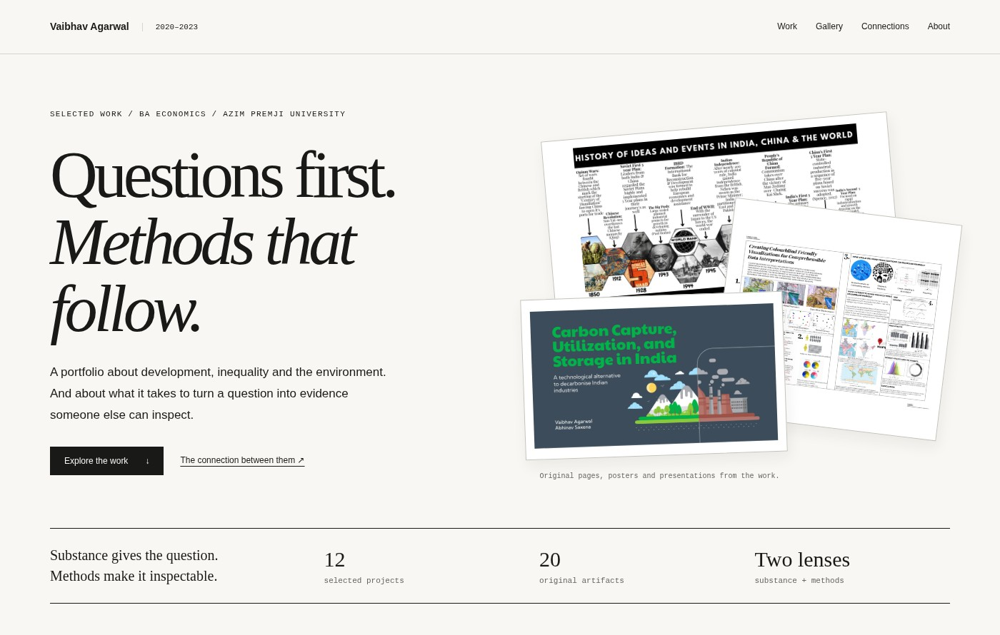
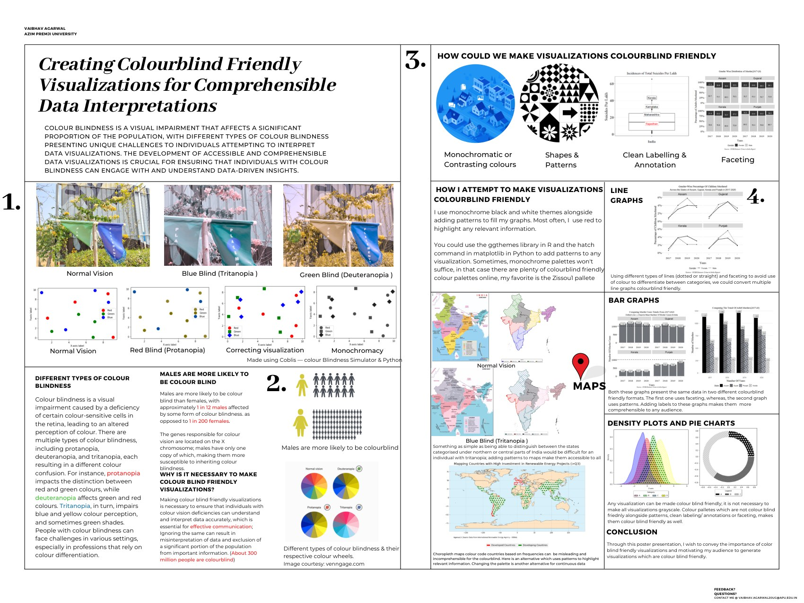
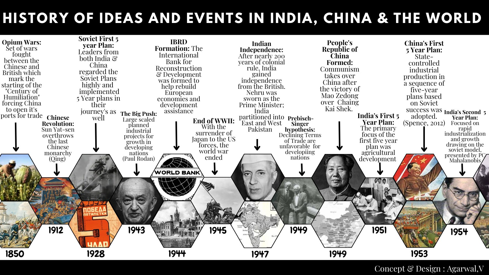
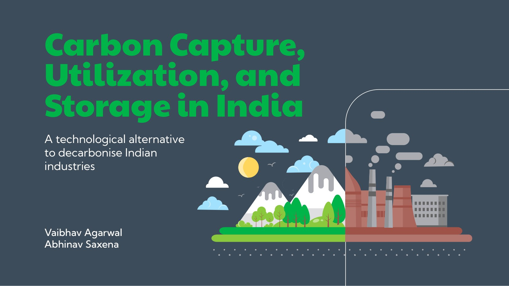

# 2020–2023 Portfolio

**Vaibhav Agarwal · BA Economics · Azim Premji University**

## Questions first. Methods that follow.

Development, inequality, the environment, and the work of turning a question into evidence someone else can inspect.

[Selected work](#selected-work) · [The visual work](#the-visual-work) · [Connections](#follow-a-question) · [Browse the website](#the-portfolio-website)



### Substance gives the question. Methods make it inspectable.

This collection is not just a record of moving from economics towards coding. It is about holding two things together: a question worth asking and a way of studying it that another person can examine.

**Substance:** how economies develop; how resources, costs and opportunities are distributed; how technologies interact with institutions; and what the categories in our data leave out.

**Methods:** economic modelling, household microdata, empirical replication, public-data scraping, rule-based computation and visual explanation.

The connection between them is the point. A regression needs a substantive question. A compelling social argument needs evidence. A carefully built dataset still needs an account of what its variables mean.

## Selected work

### 01 / Climate, development and a model that can be inspected

**[Renewable energy & economic growth](projects/renewable-energy-growth/)**

Can renewable investment fit into a model of how economies grow? This project connects an augmented Solow framework to cross-country data, alternative proxies and robustness checks. The research paper, short summary and SRC presentation show the same argument at different levels of detail.

**Substance:** climate and growth. **Methods:** theory-to-variable translation, cross-country data assembly and regression.

### 02 / Everyday conditions, household-level evidence

**[Health & livelihoods](projects/health-and-livelihoods/)**

A group project using NSS social-consumption health data to study household facilities and treatment expenditure. The report, descriptive tables and regression analysis are kept together, making the steps from measurement to interpretation visible.

**Substance:** household amenities, access and the financial burden of illness. **Methods:** microdata, recoding, grouped comparisons and regression.

### 03 / The work before an analysis can begin

**[From a public webpage to a dataset](projects/public-distribution-scraping/)**

A Python notebook that extracts a block-level Jharkhand public-distribution table, cleans its rows, assigns a schema and converts numeric columns. The contribution is the transformation from published information to usable data, not simply the use of a scraping library.

**Substance:** public-service information. **Methods:** Requests, BeautifulSoup, pandas and explicit cleaning rules.

### 04 / The categories are part of the argument

**[What a crime category can hide](projects/crime-data-categories/)**

A 62-page group booklet on categorisation and interpretation, with comparative visual analysis for four states. It connects the recorded series to the definitions, denominators and reporting questions behind them. The closing measurement discussion is worth reading alongside the charts.

**Substance:** administrative records and social interpretation. **Methods:** category review, comparative graphics and measurement critique.

## The visual work

<table>
<tr>
<td width="50%" valign="top">
<a href="projects/data-visualization/"></a>
<h3>Making evidence legible</h3>
<p>A colour-blind-friendly visualisation poster alongside a Python sketchbook. Design is part of whether an analytical comparison can be understood.</p>
<p><a href="projects/data-visualization/">Poster + notebook →</a></p>
</td>
<td width="50%" valign="top">
<a href="projects/india-china-development/"></a>
<h3>Two development paths</h3>
<p>A two-page historical timeline paired with comparisons of social indicators, employment and structural change.</p>
<p><a href="projects/india-china-development/">Timeline + data assignments →</a></p>
<a href="projects/ccus-india/"></a>
<h3>Beyond the technology</h3>
<p>A CCUS review and presentation connecting technical processes to economic, environmental and institutional conditions.</p>
<p><a href="projects/ccus-india/">Report + presentation →</a></p>
</td>
</tr>
</table>

## More questions, different methods

| Work | Substance | Methodological contribution |
|:--|:--|:--|
| [Water-pricing replication](projects/replication-water-pricing/) | Incentives and a water-saving practice | Reconstructing eight published tables; interpreting treatment interactions and specifications |
| [Education & wages](projects/education-and-wages/) | Education across different labour-market settings | PLFS microdata, employment groups, regression and rural–urban interactions |
| [Renewable-energy finance](projects/renewable-finance-geopolitics/) | The geography and form of development finance | Separating loans, grants and equity; country classifications, maps and grouped comparisons |
| [Financial ideas in code](projects/piotroski-stock-scoring/) | Translating an accounting framework into rules | Statement retrieval, ratios and inspectable conditional Python logic |
| [Rajasthan data story](projects/rajasthan-suicide-data-story/) | Interpreting a reported social pattern | Combining maps, tables and narrative while keeping aggregate inference limits visible |

## Follow a question

**How would we know?** [Growth modelling](projects/renewable-energy-growth/) → [Water-pricing replication](projects/replication-water-pricing/) → [Education & wages](projects/education-and-wages/).

**Before the model.** [Scraping administrative data](projects/public-distribution-scraping/) → [Defining household measures](projects/health-and-livelihoods/) → [Questioning inherited categories](projects/crime-data-categories/).

**For the reader.** [Accessible visualisation](projects/data-visualization/) → [Historical context](projects/india-china-development/) → [Explaining a technical system](projects/ccus-india/).

## The portfolio website

The repository includes a complete static website in `index.html`: a substance/methods switch, subject and method filters, search, two-project comparison, a visual gallery, individual project pages and browser-readable notebooks.

To browse locally, open `index.html` in a browser. No installation is needed. To use a local server instead:

```bash
python3 -m http.server 8000 --bind 127.0.0.1
```

Then open `http://127.0.0.1:8000`. [Publishing instructions](PUBLISHING.md) explain how to put the same site on GitHub Pages.

Project descriptions live in `catalogue/projects.json`. After editing them, run `python3 tools/build_portfolio.py` and `python3 -m unittest discover -s tests -v`. The build never executes the original notebooks.

## The original work

The collection contains **12 projects and 20 original artifacts**. Papers, presentations and notebooks are kept alongside a short account of the substance, methods, available evidence and interpretation limits. A PDF-only project is not presented as a runnable pipeline, and exploratory notebooks remain distinguishable from tested software.

Several pieces were group coursework. Contributors are credited on the individual project pages and in the original author lists. Figure credits and references remain in the source documents.
