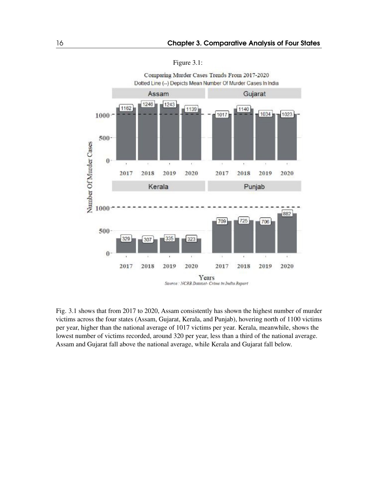

# What a crime category can hide

**What changes when a social event is recorded as a category?**

[Back to the portfolio](../../README.md) · [Browser project page](index.html)

*Comparative visual evidence from the group booklet, p. 16.*

## Substance

This collaborative booklet examines the categories used in the crime data it studies and compares selected series for Assam, Gujarat, Kerala and Punjab. The important question is what those recorded categories can and cannot tell a reader.

## Methods

Category review, four-state visual comparisons, word-frequency displays and colour-blind-friendly graphics. The closing sections explicitly discuss categorisation, reporting and the interpretation of administrative data.

## What the work brings out

The booklet returns from its state comparisons to the categories and reporting processes that made those comparisons possible. Its central measurement argument is that a recorded count needs an account of what was counted, how it was classified and what did not enter the record.

## The connection

The work connects a substantive subject to the construction of its evidence. Choosing a denominator, a category or a reporting rule is part of the analysis, not a neutral step that precedes it.

## Open the work

- [Categorisation and interpretation booklet](crime-categorisation-report.pdf) · 62 pages · PDF

## Where to look first

**[How the comparison is set up](crime-categorisation-report.pdf#page=14)**, PDF p. 14. The selected states and the visual approach.

**[Compare the visual evidence](crime-categorisation-report.pdf#page=16)**, PDF p. 16. An example of the booklet’s comparative plots.

**[Read the measurement discussion](crime-categorisation-report.pdf#page=40)**, PDF p. 40. The sections on categorisation and interpretation.

Scope, interpretation and available material

This is a historical coursework analysis of the sources cited in the booklet, not an account of current crime or current law. Its charts should not be used as a ranking of state safety. The original data and plotting scripts are not part of this selection.

## Credit

Group work by Akshara, Chanakya, Hami and Vaibhav, as credited on the cover.

## Connected work

[Making evidence legible](../data-visualization/) · [Reading a pattern without overstating it](../rajasthan-suicide-data-story/)
