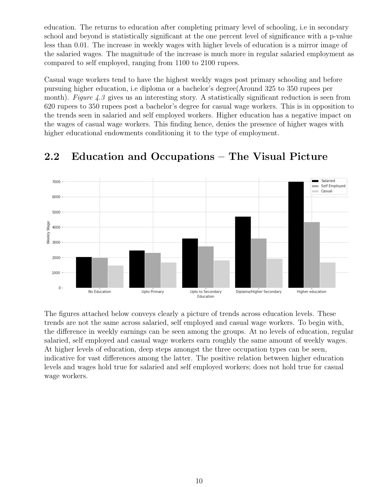

# Education does not meet one labour market

**Does the education–earnings relationship differ across kinds of work?**

[Back to the portfolio](../../README.md) · [Browser project page](index.html)

*A grouped comparison from the education-and-wages paper, p. 11.*

## Substance

The paper studies education and weekly earnings among salaried, self-employed and casual workers, with attention to rural–urban differences. Its central contribution to the portfolio is the refusal to treat one average relationship as the whole labour-market story.

## Methods

The report uses PLFS 2018–19 data, education categories, employment groups, regression controls and interaction terms. Maps and grouped charts accompany the regression tables, and the methods section describes pandas-based variable preparation.

## What the work brings out

The paper reports different education–earnings patterns across salaried, self-employed and casual work, then examines rural–urban differences. The substantive argument is that the labour-market setting changes how an education coefficient should be interpreted.

## The connection

The economic question is heterogeneous returns. The methodological task is to define comparable groups, select a baseline and keep the interpretation of coefficients aligned with those choices.

## Open the work

- [Computational economics paper](computational-economics-paper.pdf) · 23 pages · PDF

## Where to look first

**[Data and method](computational-economics-paper.pdf#page=6)**, PDF p. 6. The PLFS data and variable-preparation choices.

**[See the grouped visual comparison](computational-economics-paper.pdf#page=11)**, PDF p. 11. Education and occupation in the descriptive results.

**[Inspect the regression tables](computational-economics-paper.pdf#page=16)**, PDF p. 16. The model outputs that support the discussion.

Scope, interpretation and available material

The supplied artifact is a research paper; its analysis code and source microdata are not bundled. Group differences and regression associations do not by themselves identify causal returns to schooling. Sample restrictions and coding choices matter for interpretation.

## Credit

Vaibhav Agarwal.

## Connected work

[Health & livelihoods](../health-and-livelihoods/) · [Two development paths, several measures](../india-china-development/)
