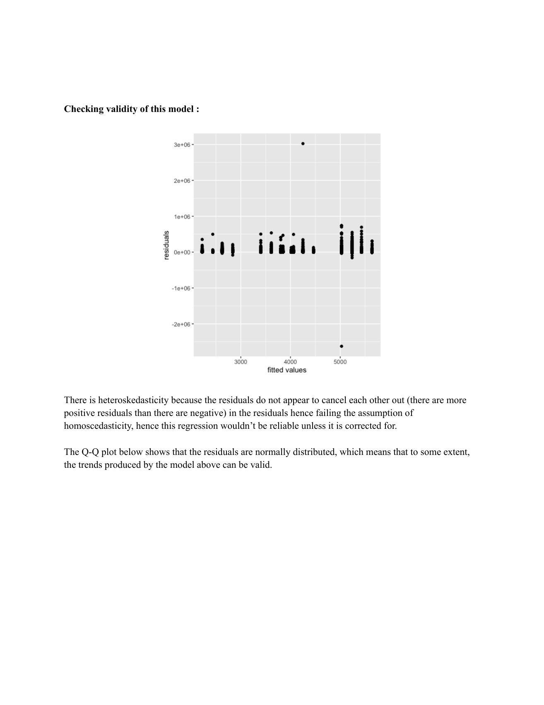

# Health & livelihoods

**How are household amenities related to the financial burden of illness?**

[Back to the portfolio](../../README.md) · [Browser project page](index.html)

*Residual diagnostics and their discussion in the regression note, p. 5.*

## Substance

This group project studies health expenditure alongside cooking fuel, drainage and latrine facilities. Its substantive focus is access to everyday amenities and the costs of treatment, including the distinction between public and private care.

## Methods

NSS 71st-round social-consumption health data, recoded household facilities, grouped descriptive tables and regression. The separate report, tables and regression note make it possible to inspect the stages of the analysis rather than only its final narrative.

## What the work brings out

The regression note reports lower expenditure for some households with less clean facilities, then raises access to treatment as an alternative explanation. That is a substantive result worth pausing over: lower spending cannot automatically be read as better health.

## The connection

Access, exposure and spending are different concepts. The project is useful precisely because it has to decide how to operationalise each one before drawing comparisons between households.

## Open the work

- [Research report](report.pdf) · 9 pages · PDF

- [Descriptive tables](tables.pdf) · 4 pages · PDF

- [Regression analysis](regression-analysis.pdf) · 6 pages · PDF

## Where to look first

**[Research question and data](report.pdf#page=1)**, PDF p. 1. How household amenities motivate the analysis.

**[The descriptive evidence](tables.pdf#page=1)**, PDF p. 1. A separate set of tables that can be inspected beside the narrative.

**[From groups to a model](regression-analysis.pdf#page=2)**, PDF p. 2. Specification and discussion of the expenditure relationships.

Scope, interpretation and available material

The table set includes an explicitly unweighted disease-specific comparison, so the collection should not be described as uniformly survey-weighted. These are observational expenditure associations, not estimates of the causal health benefit of a facility. Unit-level data and analysis code are not bundled.

## Credit

Group work. The regression note credits Neha, Vighnesh, Saranyan, Vaibhav and Vijayshree; original author lists remain in the documents.

## Connected work

[Education does not meet one labour market](../education-and-wages/) · [From a public webpage to a dataset](../public-distribution-scraping/)
