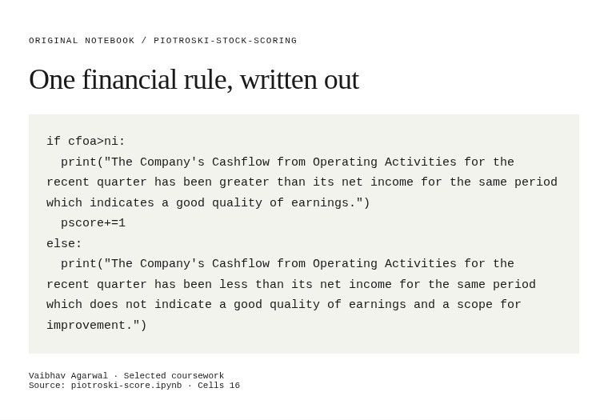

# Piotroski stock scoring

[← All projects](../../README.md) · [Project page](index.html)

A coursework implementation of Piotroski-style stock scoring. The notebook retrieves financial statements with yfinance and uses accounting ratios and conditional rules to build a score. Explanations sit alongside the corresponding Python calculations.

Python · yfinance · Financial ratios

*Original cash-flow comparison code from the group notebook.*

## Files

- [Financial-scoring notebook](piotroski-score.ipynb) · Python notebook

  [Read code and saved outputs](notebook.html).

This is a coursework draft, not a validated F-score implementation. It uses positional statement indexing and repeats the same average-assets expression for both periods.

**By:** Vaibhav, Hami and Abhinav.
