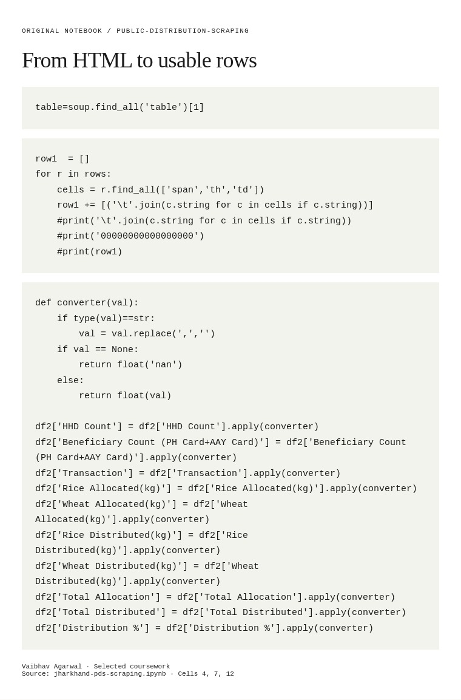

# From a public webpage to a dataset

**How can an administrative report become material for analysis?**

[Back to the portfolio](../../README.md) · [Browser project page](index.html)

*Original extraction and cleaning code from the notebook.*

## Substance

The notebook works with a block-level public-distribution report from Jharkhand. It makes a concrete piece of public-service information available in a more useful form: counts of households and beneficiaries, transactions, allocations and distribution.

## Methods

Requests retrieves the page; BeautifulSoup selects a table; Python cleans row text; pandas supplies column labels and numerical conversion. A later section also explores an Excel workbook using openpyxl.

## What the work brings out

The concrete output is a labelled table with twelve fields, including household and beneficiary counts, grain allocation, grain distribution and a distribution percentage. The notebook makes the difference between information being publicly visible and being ready to analyse quite tangible.

## The connection

This is an early data-collection pipeline. The useful work is not just acquiring a page, but imposing an explicit schema and handling formatting so that the figures can be analysed.

## Open the work

- [Public-distribution scraping notebook](jharkhand-pds-scraping.ipynb) · 24 cells · Python notebook

  [Read code and saved outputs in a browser](notebook.html).

Scope, interpretation and available material

The scraper is specific to one page layout and selects a table by position. The later Excel section expects Bokaro.xlsx, which is not included. Live access and compatibility with the present website have not been tested; the saved code and outputs can be read without a request to the site.

## Credit

From Vaibhav Agarwal’s coursework archive. The notebook does not contain a separate contributor statement.

## Connected work

[Health & livelihoods](../health-and-livelihoods/) · [Turning a financial idea into rules](../piotroski-stock-scoring/)
