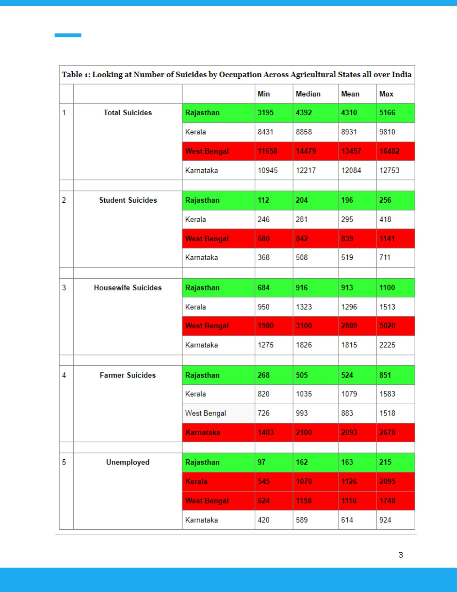

# Rajasthan suicide data story

[← All projects](../../README.md) · [Project page](index.html)

An exploratory data story about reported suicide patterns in Rajasthan. It brings together comparative indicators, maps and literature in a written report.

Visualisation · Mapping · Data storytelling

*A comparison table from the original data story, p. 4.*

## Files

- [Visual data story](data-story.pdf) · PDF · 16 pages

The cultural explanation discussed in the paper is exploratory, not an established causal finding.

**By:** Vaibhav Agarwal.
