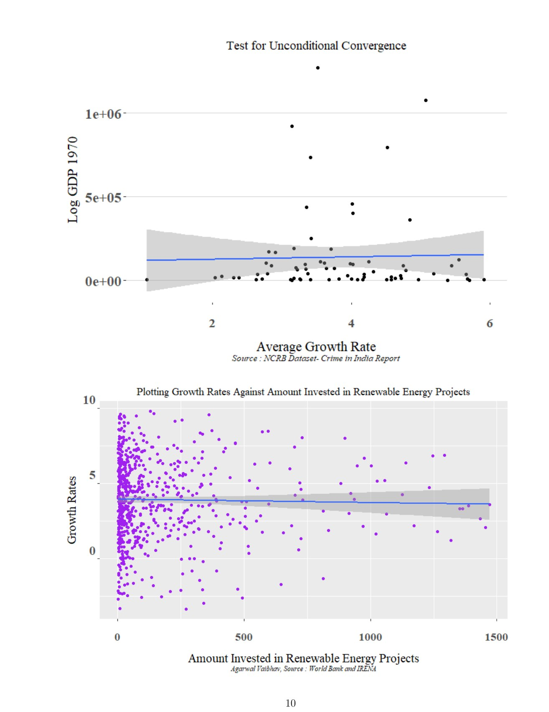

# Renewable energy & economic growth

**Can renewable investment fit into an account of how economies grow?**

[Back to the portfolio](../../README.md) · [Browser project page](index.html)

*Short-run comparisons from the research paper, p. 11.*

## Substance

The paper brings renewable-energy investment into a familiar growth question: conditional convergence. Rather than treating climate and growth as separate subjects, it asks how an augmented Solow framework changes when renewable investment and related proxies enter the model.

## Methods

Cross-country data assembly, an augmented Solow specification, alternative proxies and robustness checks. The paper connects Penn World Table, World Bank, IRENA and educational-attainment data; the summary describes a 90-country sample.

## What the work brings out

The paper draws a distinction between its short-run and longer-run specifications, and interprets the additional renewable-energy terms in relation to convergence. The interesting economic argument is therefore not simply “more investment is good”: it depends on the time horizon, the proxy and the model being estimated.

## The connection

The contribution is the connection from theory to an observable quantity: deciding what should stand for renewable investment, adding it to a growth model, then asking how much the conclusion depends on that choice.

## Open the work

- [Research paper](term-paper.pdf) · 16 pages · PDF

- [Research summary](research-summary.pdf) · 6 pages · PDF

- [SRC presentation](research-presentation.pdf) · 12 pages · PDF

## Where to look first

**[Start with the empirical strategy](term-paper.pdf#page=7)**, PDF p. 7. The model and the role assigned to each variable.

**[Then inspect the evidence](term-paper.pdf#page=8)**, PDF p. 8. Data sources, reported results and robustness discussion.

**[Read the short account](research-summary.pdf#page=2)**, PDF p. 2. The research question and the author’s interpretation in one place.

Scope, interpretation and available material

The report presents estimated relationships, not a design that independently identifies a causal effect. Model fit and a significant coefficient do not by themselves establish that renewable investment causes faster growth. The raw merged data and estimation scripts are not included here.

## Credit

Vaibhav Agarwal.

## Connected work

[Following renewable-energy finance](../renewable-finance-geopolitics/) · [Rebuilding the evidence on water pricing](../replication-water-pricing/)
