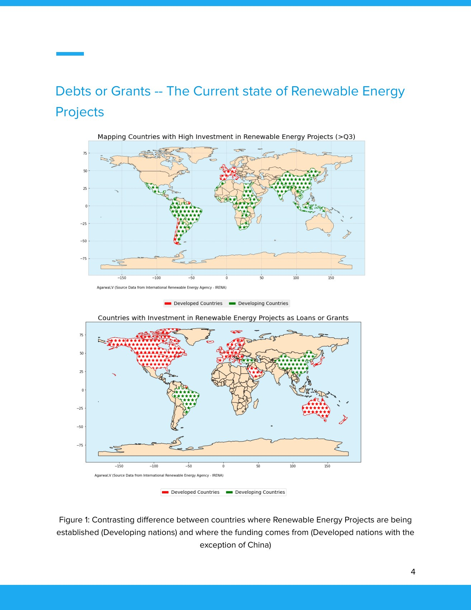

# Renewable-energy finance

[← All projects](../../README.md) · [Project page](index.html)

A study of renewable-energy finance using IRENA investment data and World Bank income classifications and GDP measures. It compares loans, grants and equity across regions and income groups, with maps and tables covering India, China and African countries.

Data analysis · Maps · Energy finance

*The original spatial comparison in the finance paper, p. 5.*

## Files

- [Renewable-finance paper](final-paper.pdf) · PDF · 15 pages

**By:** Vaibhav Agarwal.
