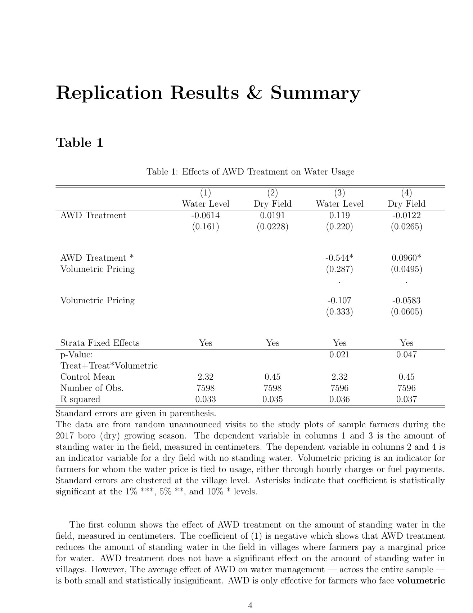

# Water-pricing replication

[← All projects](../../README.md) · [Project page](index.html)

A replication exercise based on “Inefficient water pricing and incentives for conservation” by Ujjayant Chakravorty, Manzoor H. Dar and Kyle Emerick (2019). The report works through Tables 1–8, including treatment interactions, fixed effects and village-clustered standard errors.

Replication · Econometrics · Water conservation

*The first replicated table and its interpretation, p. 6.*

## Files

- [Replication report](replication-paper.pdf) · PDF · 18 pages

The report is included; the replication dataset and scripts are not.

**By:** Replication report: Vaibhav Agarwal. Original study: Ujjayant Chakravorty, Manzoor H. Dar and Kyle Emerick.
